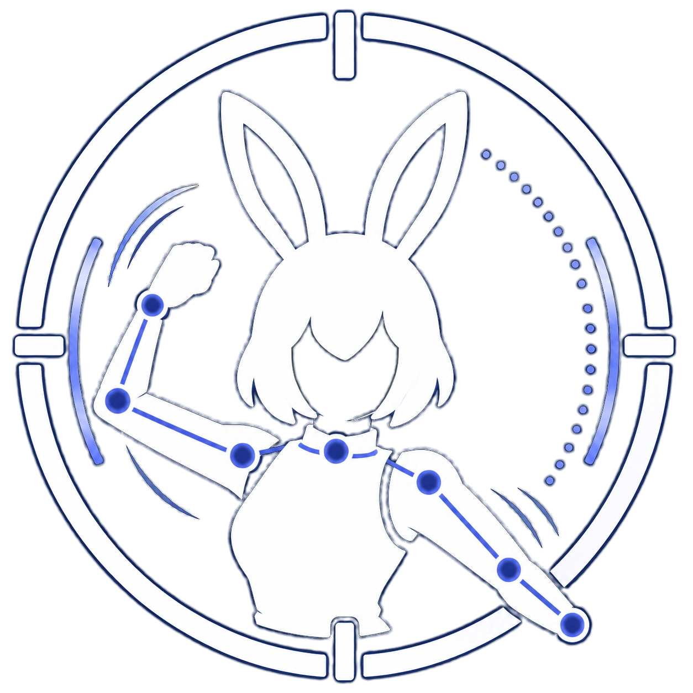

<p align="center">
  
</p>

# U.N. Motion

U.N. Motion は Web カメラでアバターを動かしたり、他のアプリからVMCを貰って合成したりできる「モーションキャプチャ」アプリです。

カメラ映像から体・顔・手を推定し、U.N. Avatar や UNMF/Z 対応アプリや VMC 対応アプリへリアルタイムにモーションを送ります。
特別なモーションキャプチャスーツや専用トラッカーなしで、Web カメラだけでも始められます。

## 想定ユーザー

- Web カメラだけでアバターを動かしたい VStreamer / VTuber / virtual avatar user
- U.N. Avatar と組み合わせて、軽量で扱いやすい webcam mocap 環境を作りたい民
- VMC 対応アプリへ体・顔・手のモーションを送りたい民
- 自作ツールや研究用途で U.N. Motion Frame を受け取りたい開発者

## できること

- Web カメラから 頭、顔、手、腕、胴体、脚、足 をお好みで必要な部分だけ推定して UNMF/Z や VMC/UDP で出力できます。
- 他のアプリから VMC を受け取って、頭、顔、手、腕、胴体、脚、足 の単位でフィルターやスムージングをかけつつ UNMF/Z や VMC/UDP で出力できます。
- U.N. Avatar や他のアバターアプリと UNMF/Z または VMC/UDP で接続できます。
- 複数のカメラや推定エンジンをプロファイルとして保存しておいて、用途に合わせて切り替えたり同時に使えます。
- ポージング/モーションを録画して再生できます。

## ここが嬉しい

- 軽量で高速: 一般的なゲーミングPCなら高性能なカメラを接続して90fps程度の推定をCPU2コア負荷ほどほど、メモリー200MB程度で動作可能です。
- 豊富な補正機能: パラメーター調整可能な複数の方法でのスムージング、フェイス姿勢補正モデルによる高精度な頭と顔の姿勢推定、部位単位での出力フィルターなど。
- なんとなく安心: Webcam の映像を表示したり保存したりどこかへ送りつけたりする機能は一切ありません。

## 一般的な使い方

1. U.N. Motion Supervisor を起動します。
2. Profiles でプロファイルを作成します。
3. カメラ、推定エンジン、出力先を設定します。
4. Capturers で個別のプロファイルまたはグループを選び、Launch します。
5. 必要に応じて顔姿勢補正モデルや U / T / I キャリブレーションを作成します。
6. UNMF/Z、VMC 対応アプリで受信して何かします。例えば U.N. Avatar でアバターを動かしながら U.N. Virtual Eye Tracker でトラックを運転するとか。

## カメラについて

通常の 30 fps Web カメラでも動作しますが、モーションの安定性はカメラ品質の影響をかなり受けます。

- 「60 fps 以上」のカメラがおすすめです。
- ローリングシャッターより「グローバルシャッター」の方が安定しやすいです。
- 暗い部屋や強い逆光では推定が不安定になりやすいです。服装や背景からなんとなく推定して貰いやすそうだなと思える準備がカメラ性能と同等かそれ以上に重要です。
- 手や指を使いたい場合は、手のひらが見える明るさと解像度がかなり重要です。(320x240より640x480くらいがよいです。それより大きい解像度は必要ありません。)
- Tポーズでキャリブレーションしたい、デスクトップでも手を広げて動かしたい、全身を狭い空間で動かしたい場合などは、広角レンズ搭載の Webcam がおすすめです。

おすすめカメラの例:

- [ELP 1080P 90FPS Global Shutter Camera / 2.8f 120deg 640x480@90fps MJPG](https://amzn.to/4dmWfAL)
- または何はともあれ [グローバルシャッターのカメラ](https://amzn.to/4uUemDU)
- もしUSB接続などでWebcam化できるコンデジ/デジカメ/アクションカメラをお持ちなら並のWebcamより良い感じに使える事もあります。

※Windows では DirectShow と MediaFoundation の両方に対応しています。OBS 仮想カメラなど DirectShow 側でしか使えないデバイスもあるのでとりあえず迷ったら DirectShow で使って下さい。

## 開発者向け

この repository には Supervisor GUI、Capturer runtime、MediaPipe Native bridge、入力、Modifier、出力、release tooling が含まれています。

よく使うコマンド:

```sh
cargo xtask verify
cargo run
cargo xtask make-release-package --version 1.0.0
```

MediaPipe Native DLL を更新する場合:

```sh
cargo xtask mediapipe build-native
```

Supervisor の UI を HMR で編集する場合:

```sh
cd apps/un-motion-supervisor
npm install
npm run tauri dev
```

## ドキュメント

- [Architecture](docs/architecture.md): 現行設計、crate の役割、入出力境界
- [Capturer Pipeline](docs/capturer-pipeline.md): `Input -> Engine -> UNMotionFrame -> Modifier -> Output` の正式経路
- [Release Readiness](docs/release-readiness.md): v1 の境界、既定値、リリース前確認
- [MediaPipe Native Requirements](docs/media-pipe-native-requirements.md): Native DLL、delegate、performance、Windows GPU delegate の扱い
- [Development Guidelines](docs/development-guidelines.md): 開発時の確認方針
- [xtask](docs/xtask.md): build / verify / package / MediaPipe helper commands
- [Third-party Notices](THIRD_PARTY_NOTICES.md): third-party licenses

## 関連プロジェクト

- [U.N. Motion Frame](https://github.com/usagi/un-motion-frame): U.N. Motion の標準モーションフレーム形式および U.N. Motion Frame / Zenoh (UNMF/Z) プロトコルの定義
- [U.N. Avatar](https://github.com/usagi/un-avatar): UNMF/Z や VMC に対応した仮想アバターレンダラー
- [U.N. Virtual Avatar Connect](https://github.com/usagi/un-virtual-avatar-connect): 仮想アバターとすべてを繋ぐデータフロー駆動のブリッジアプリ
- [U.N. Virtual Eye Tracker](https://github.com/usagi/un-virtual-eye-tracker): 仮想アイトラッカー

## License

[MIT](LICENSE)

Third-party components keep their own licenses. See [THIRD_PARTY_NOTICES.md](THIRD_PARTY_NOTICES.md).

## Author

[usagi / USAGI.NETWORK](https://usagi.network)
